# Recovered user attachment

Source attachment ID: `2cb03736-48a8-4eb3-a940-5a7e2f8fcaaf`. Original text follows verbatim; proposals and historical instructions retain their original status.

Dựa trên baseline B3 hiện tại của RuleSphere — **Decision Management / Decision Delivery / Decision Execution** — state model nên tách thành nhiều lifecycle độc lập thay vì tạo một state khổng lồ. Việc tách này rất quan trọng vì một **Decision Version đã Approved** không đồng nghĩa với **Release đã Deployed**, và một deployment có thể rollback mà không làm thay đổi trạng thái authoring của version.

Các state dưới đây là **proposed state model để đưa vào SRS/System Design**; những state chưa được baseline xác nhận nên xem là *proposal*, không phải confirmed requirement.

## 1. Overall RuleSphere lifecycle

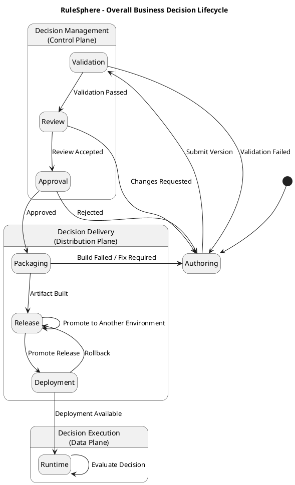

Điểm quan trọng là:

```text
Authoring lifecycle
        ↓
Approval lifecycle
        ↓
Immutable Artifact
        ↓
Release lifecycle
        ↓
Deployment lifecycle
        ↓
Runtime execution
```

Không nên dùng một field duy nhất kiểu:

```text
Decision.status = DEPLOYED
```

để biểu diễn toàn bộ vòng đời.

---

# 2. Decision state

`Decision` là logical business entity/container, khác với `Decision Version`.

Ví dụ:

```text
Decision: Customer Credit Eligibility
 ├─ Version 1
 ├─ Version 2
 └─ Version 3
```

State của Decision nên tương đối đơn giản.

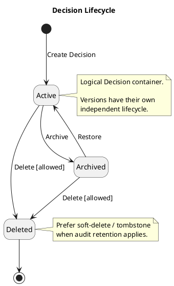

### Decision transitions

| From | Transition | To | Typical Actor |
|---|---|---|---|
| — | Create Decision | Active | Rule / Decision Author |
| Active | Archive | Archived | Author / Administrator |
| Archived | Restore | Active | Author / Administrator |
| Active | Delete | Deleted | Administrator |
| Archived | Delete | Deleted | Administrator |

`Deleted` cần được làm rõ trong requirement:

- hard delete;
- soft delete;
- hoặc logically deleted nhưng vẫn giữ audit record.

Đối với RuleSphere, **soft delete / tombstone** hợp lý hơn nếu auditability là requirement.

---

# 3. Decision Version lifecycle

Đây là lifecycle quan trọng nhất của Control Plane.

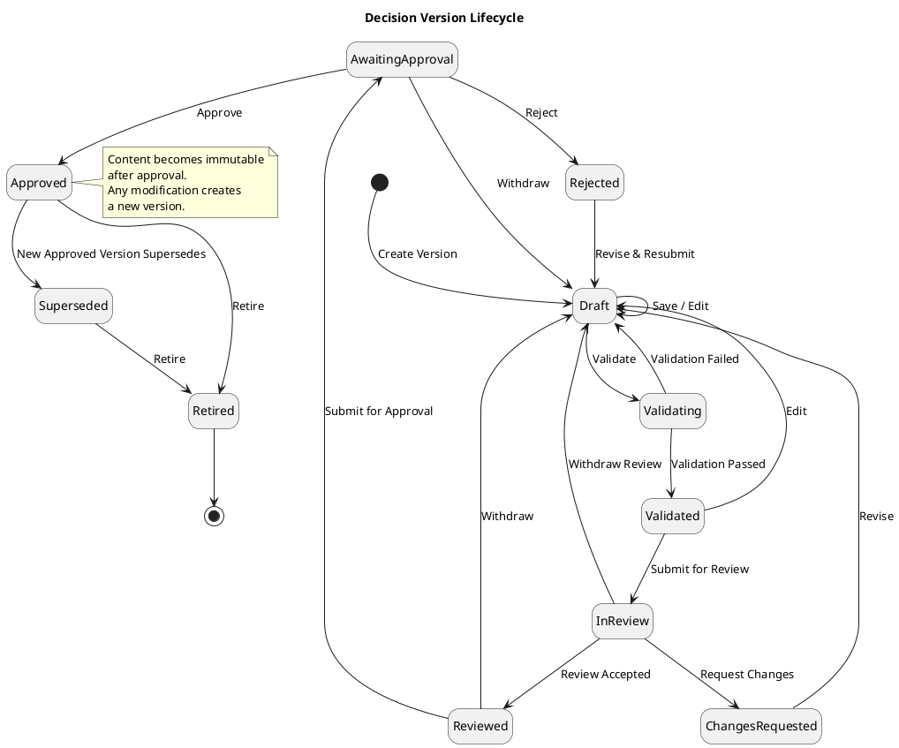

## State set

```text
Draft
Validating
Validated
InReview
ChangesRequested
Reviewed
AwaitingApproval
Rejected
Approved
Superseded
Retired
```

Có thể rút gọn `Reviewed → AwaitingApproval` nếu reviewer và approver là cùng một workflow, nhưng với actor model hiện tại:

- Reviewer / Approver

nên vẫn giữ abstraction đủ linh hoạt.

---

# 4. Validation state machine

Validation bản thân cũng có thể có substate.

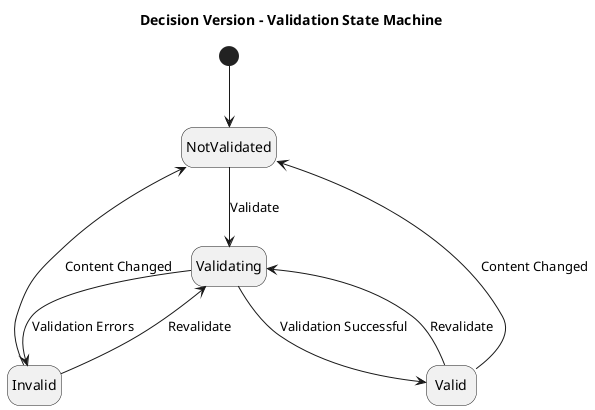

Validation có thể aggregate nhiều loại check:

```text
Syntax Validation
Semantic Validation
Schema Validation
Reference Validation
Dependency Validation
Type Validation
Static Analysis
Policy Validation
Test Validation
```

Không nên tạo state riêng kiểu `SyntaxValidated`, `SchemaValidated`, ... ở entity chính.

Thay vào đó:

```text
ValidationRun
    status
    checks[]
```

---

# 5. Review lifecycle

Nếu review được model thành entity riêng:

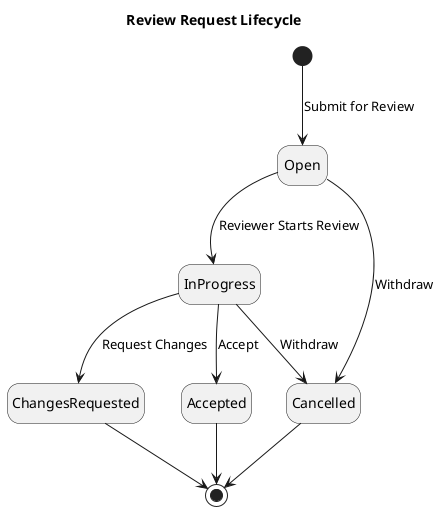

States:

```text
Open
InProgress
ChangesRequested
Accepted
Cancelled
```

---

# 6. Approval lifecycle

Approval nên tách khỏi review nếu hệ thống hỗ trợ governance workflow.

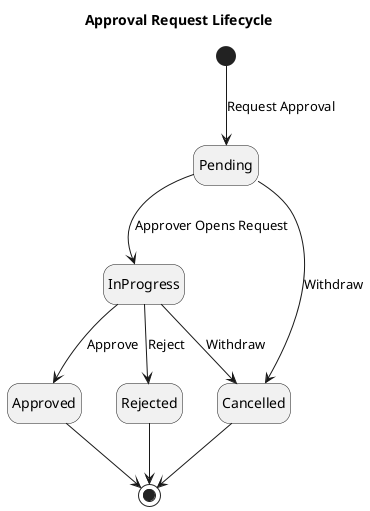

Nếu hỗ trợ multi-approver:

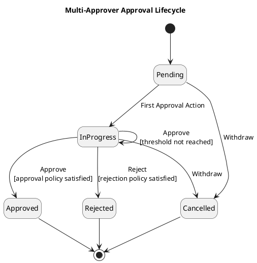

Guard:

```text
[approval policy satisfied]
[rejection policy satisfied]
```

cho phép sau này hỗ trợ:

```text
ANY
ALL
N_OF_M
ROLE_BASED
SEQUENTIAL
```

mà không thay đổi state model.

---

# 7. Test execution lifecycle

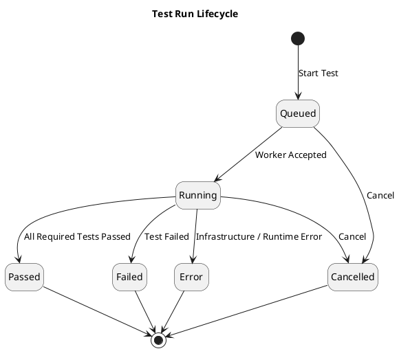

Phân biệt:

```text
Failed
```

= decision behaved incorrectly relative to expected assertion.

```text
Error
```

= không thể thực hiện test đúng cách.

Ví dụ:

```text
Failed
Expected: APPROVE
Actual:   REJECT
```

so với:

```text
Error
Runtime unavailable
Dependency unavailable
Malformed test fixture
```

---

# 8. Artifact build lifecycle

Approved Decision Version được materialize thành immutable artifact.

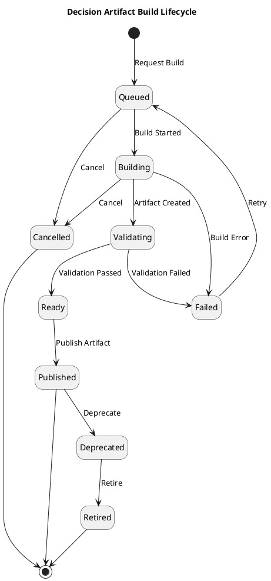

States:

```text
Queued
Building
Validating
Ready
Published
Failed
Cancelled
Deprecated
Retired
```

Một artifact `Published` phải bất biến.

---

# 9. Release lifecycle

`Release` khác `Artifact`.

Artifact:

```text
immutable executable package
```

Release:

```text
a governed delivery candidate referencing one or more artifacts
```

State machine:

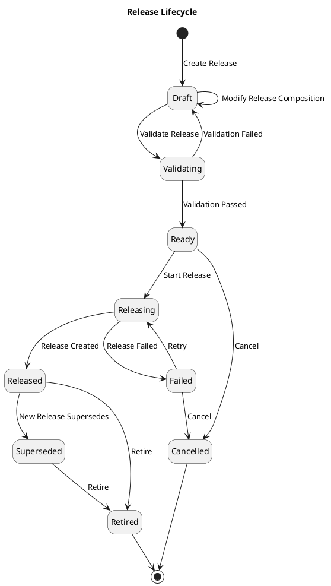

---

# 10. Environment promotion lifecycle

Nếu RuleSphere có:

```text
Development
Testing
Staging
Production
```

thì **environment không phải state của Decision Version**.

Không nên:

```text
Draft
↓
Testing
↓
Staging
↓
Production
```

Mà nên:

```text
Release X
   ↓ deployed to
Environment Y
```

Promotion:

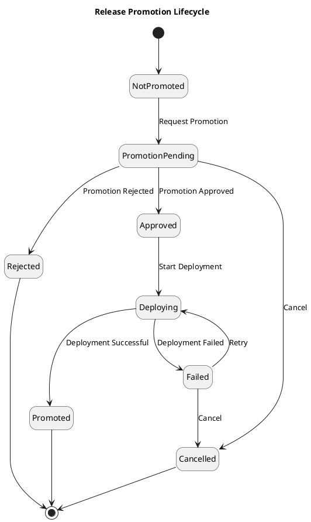

---

# 11. Deployment lifecycle

Đây là core lifecycle của Distribution Plane.

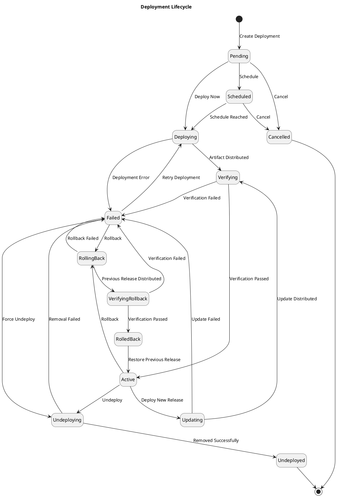

Core states:

```text
Pending
Scheduled
Deploying
Verifying
Active
Updating
RollingBack
VerifyingRollback
RolledBack
Undeploying
Undeployed
Failed
Cancelled
```

---

# 12. Deployment target instance state

Deployment aggregate và individual runtime node không nên dùng cùng một state.

Ví dụ cluster:

```text
Deployment PROD-v42
 ├─ Runtime Node A: v42
 ├─ Runtime Node B: v42
 ├─ Runtime Node C: v41
 └─ Runtime Node D: unavailable
```

Node state:

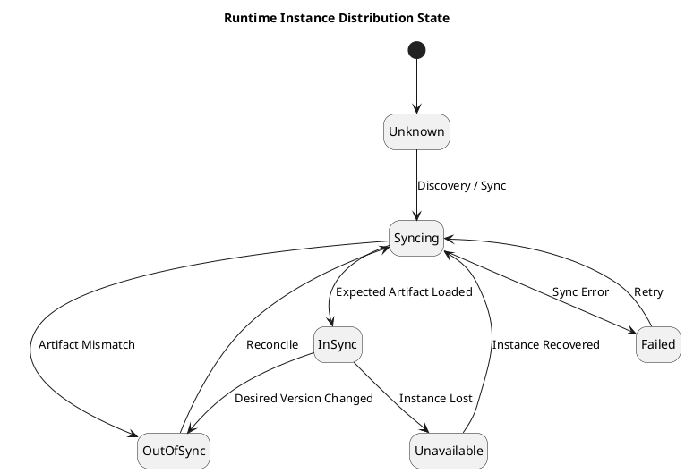

States:

```text
Unknown
Syncing
InSync
OutOfSync
Failed
Unavailable
```

Đây là foundation cho requirement **distributed convergence**.

---

# 13. Rollout strategy state

B3 đã đề cập Canary / Shadow, vì vậy rollout nên có state riêng.

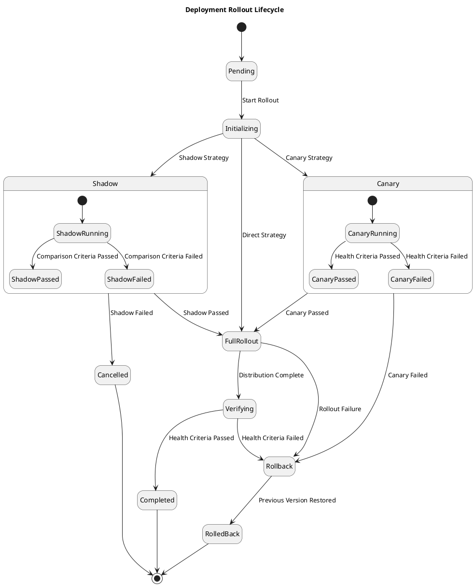

---

# 14. Canary rollout

Có thể chi tiết thêm:

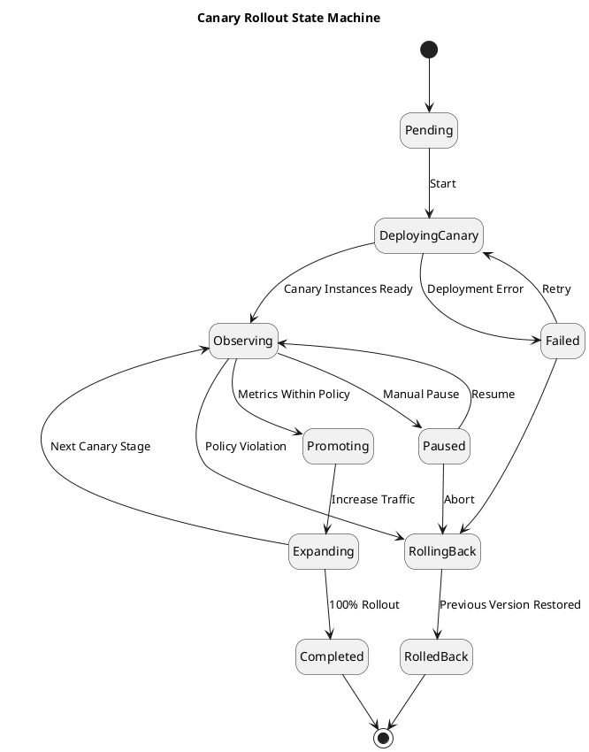

Không nên hard-code:

```text
10% → 25% → 50% → 100%
```

vào state model.

Đó nên là rollout configuration.

---

# 15. Shadow deployment

Shadow khác Canary.

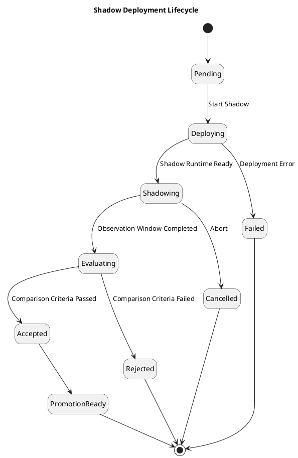

Shadow traffic:

```text
Production Request
       |
       +----> Active Version ----> response returned
       |
       +----> Shadow Version ----> result discarded/comparison only
```

Shadow version **không được trả business response cho caller**.

---

# 16. Runtime artifact state

Mỗi Decision Runtime có thể có lifecycle:

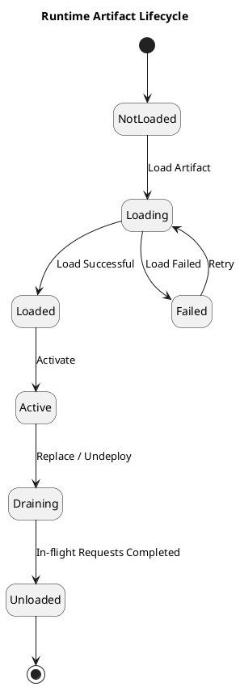

States:

```text
NotLoaded
Loading
Loaded
Active
Draining
Unloaded
Failed
```

`Draining` đặc biệt hữu ích với zero-downtime update.

---

# 17. Decision execution request lifecycle

Decision Execution phải stateless từ góc nhìn business runtime, nhưng một individual request vẫn có processing state transient.

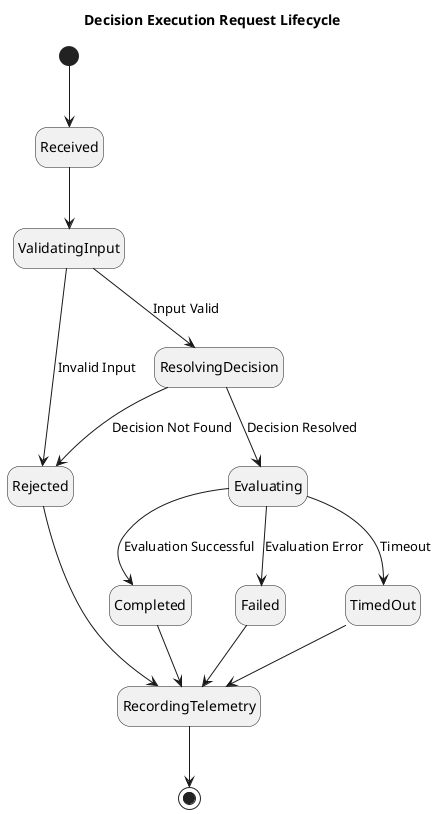

Tuy nhiên các state này **không nhất thiết phải persisted**.

Đây chủ yếu là execution model:

```text
Received
→ Validate
→ Resolve
→ Evaluate
→ Return
```

---

# 18. Decision evaluation result

Không nên gọi outcome là `execution status`.

Nên tách:

```text
ExecutionStatus
```

và

```text
DecisionOutcome
```

Ví dụ:

```text
ExecutionStatus = SUCCESS
DecisionOutcome = APPROVED
```

so với:

```text
ExecutionStatus = SUCCESS
DecisionOutcome = REJECTED
```

Cả hai đều là execution thành công.

State:

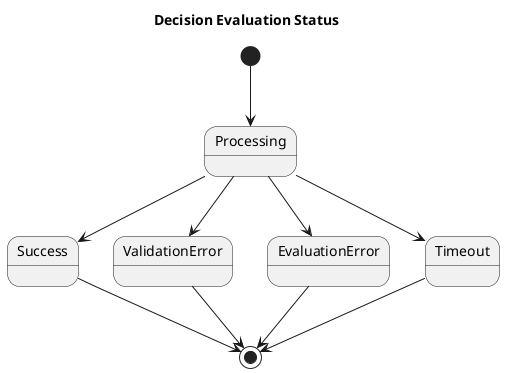

---

# 19. Audit event lifecycle

Audit event thường immutable nên không cần state machine phức tạp.

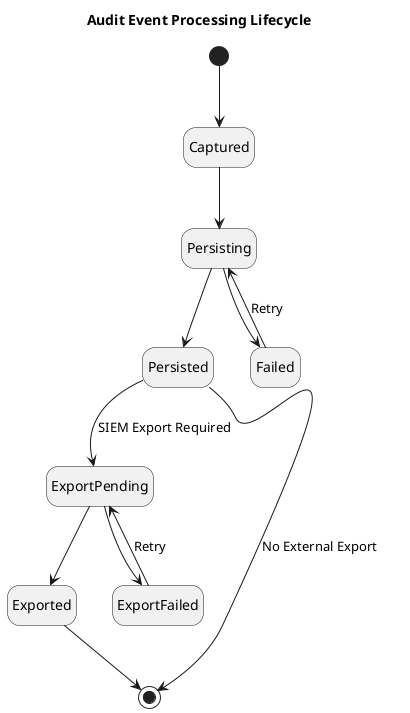

---

# 20. Webhook / notification lifecycle

Nếu RuleSphere cung cấp webhook/integration notification:

```puml
@startuml
title Event Delivery Lifecycle

hide empty description

[*] --> Pending

Pending --> Delivering

Delivering --> Delivered : 2xx / Accepted
Delivering --> RetryPending : Retryable Failure
Delivering --> Failed : Non-Retryable Failure

RetryPending --> Delivering : Retry Delay Elapsed
RetryPending --> DeadLettered : Retry Limit Exceeded

Failed --> [*]
Delivered --> [*]
DeadLettered --> [*]

@enduml
```

---

# 21. Import lifecycle

```puml
@startuml
title Decision Import Lifecycle

hide empty description

[*] --> Uploaded

Uploaded --> Parsing

Parsing --> Invalid : Parse Error
Parsing --> Validating : Parse Successful

Validating --> Invalid : Validation Failed
Validating --> Ready : Validation Passed

Ready --> Importing : Confirm Import

Importing --> Imported
Importing --> Failed

Failed --> Importing : Retry

Invalid --> [*]
Imported --> [*]

@enduml
```

---

# 22. Export lifecycle

```puml
@startuml
title Decision Export Lifecycle

hide empty description

[*] --> Requested

Requested --> Generating

Generating --> Ready
Generating --> Failed

Failed --> Generating : Retry

Ready --> Downloaded : Download
Ready --> Expired : Retention Expired

Downloaded --> Expired : Retention Expired

Expired --> [*]

@enduml
```

---

# 23. API credential lifecycle

Platform Administration:

```puml
@startuml
title API Credential Lifecycle

hide empty description

[*] --> Active : Create Credential

Active --> Rotating : Rotate
Rotating --> Active : New Credential Activated

Active --> Suspended : Suspend
Suspended --> Active : Reactivate

Active --> Revoked : Revoke
Suspended --> Revoked : Revoke

Active --> Expired : Expiration Reached

Expired --> [*]
Revoked --> [*]

@enduml
```

---

# 24. User / service identity access state

Actual identity lifecycle có thể do external IdP quản lý; RuleSphere chỉ nên maintain local access binding.

```puml
@startuml
title RuleSphere Access Binding Lifecycle

hide empty description

[*] --> Active : Grant Access

Active --> Suspended : Suspend Access
Suspended --> Active : Restore Access

Active --> Revoked : Revoke Access
Suspended --> Revoked : Revoke Access

Revoked --> [*]

@enduml
```

Không nên duplicate:

```text
Password state
MFA state
User identity lifecycle
```

nếu Identity Provider / IAM là source of truth.

---

# 25. CI/CD invocation state

```puml
@startuml
title Automation Job Lifecycle

hide empty description

[*] --> Requested

Requested --> Queued

Queued --> Running
Queued --> Cancelled

Running --> Succeeded
Running --> Failed
Running --> Cancelled

Failed --> Queued : Retry

Succeeded --> [*]
Cancelled --> [*]

@enduml
```

---

# 26. Complete Decision Version state machine with governance

Nếu muốn **một diagram đầy đủ nhất để đưa vào SRS**, mình khuyến nghị dùng version này:

```puml
@startuml
title RuleSphere - Decision Version State Machine

hide empty description
skinparam shadowing false

[*] --> Draft : Create Version

state "AUTHORING" as AUTHORING {
    Draft --> Draft : Edit / Save

    Draft --> Validating : Validate

    Validating --> Draft : Validation Failed
    Validating --> Validated : Validation Passed

    Validated --> Draft : Edit
}

state "GOVERNANCE" as GOVERNANCE {

    Validated --> InReview : Submit for Review

    InReview --> ChangesRequested : Request Changes
    InReview --> Reviewed : Accept Review
    InReview --> Draft : Withdraw

    ChangesRequested --> Draft : Revise

    Reviewed --> AwaitingApproval : Request Approval
    Reviewed --> Draft : Withdraw

    AwaitingApproval --> Approved : Approve
    AwaitingApproval --> Rejected : Reject
    AwaitingApproval --> Draft : Withdraw

    Rejected --> Draft : Revise
}

state "APPROVED / IMMUTABLE" as IMMUTABLE {

    Approved --> Superseded : Another Version Becomes Effective
    Approved --> Retired : Retire

    Superseded --> Retired : Retire
}

Retired --> [*]

note right of Draft
Mutable
end note

note right of Validated
Validation result becomes stale
when content changes.
end note

note right of Approved
Immutable.

Editing requires creation
of a new Decision Version.
end note

@enduml
```

---

# 27. End-to-end state relationship

Đây mới là cách nhìn tổng thể chính xác của RuleSphere:

```puml
@startuml
title RuleSphere - End-to-End State Relationships

left to right direction

rectangle "Decision Version" {
    [Draft] --> [Validated]
    [Validated] --> [In Review]
    [In Review] --> [Approved]
}

rectangle "Artifact" {
    [Build Pending] --> [Building]
    [Building] --> [Published]
}

rectangle "Release" {
    [Release Draft] --> [Release Ready]
    [Release Ready] --> [Released]
}

rectangle "Deployment" {
    [Deployment Pending] --> [Deploying]
    [Deploying] --> [Active]
    [Active] --> [Rolling Back]
    [Rolling Back] --> [Rolled Back]
}

rectangle "Runtime" {
    [Not Loaded] --> [Loading]
    [Loading] --> [Active Runtime]
}

[Approved] --> [Build Pending] : build
[Published] --> [Release Draft] : include artifact
[Released] --> [Deployment Pending] : deploy
[Active] --> [Loading] : distribute artifact

@enduml
```

Đây cũng thể hiện một architectural invariant rất quan trọng:

```text
Decision Version
      ≠
Artifact
      ≠
Release
      ≠
Deployment
      ≠
Runtime Instance
```

---

# 28. Tổng hợp toàn bộ state

Mình đề xuất RuleSphere hiện có ít nhất các state domain sau:

| Aggregate / Entity | States |
|---|---|
| **Decision** | Active, Archived, Deleted |
| **Decision Version** | Draft, Validating, Validated, InReview, ChangesRequested, Reviewed, AwaitingApproval, Rejected, Approved, Superseded, Retired |
| **Validation Run** | NotValidated, Validating, Valid, Invalid |
| **Review Request** | Open, InProgress, ChangesRequested, Accepted, Cancelled |
| **Approval Request** | Pending, InProgress, Approved, Rejected, Cancelled |
| **Test Run** | Queued, Running, Passed, Failed, Error, Cancelled |
| **Artifact Build** | Queued, Building, Validating, Ready, Published, Failed, Cancelled, Deprecated, Retired |
| **Release** | Draft, Validating, Ready, Releasing, Released, Failed, Cancelled, Superseded, Retired |
| **Promotion** | NotPromoted, PromotionPending, Approved, Rejected, Deploying, Promoted, Failed, Cancelled |
| **Deployment** | Pending, Scheduled, Deploying, Verifying, Active, Updating, RollingBack, VerifyingRollback, RolledBack, Undeploying, Undeployed, Failed, Cancelled |
| **Runtime Instance Sync** | Unknown, Syncing, InSync, OutOfSync, Failed, Unavailable |
| **Rollout** | Pending, Initializing, Canary/Shadow/FullRollout, Verifying, Completed, Rollback, RolledBack, Cancelled |
| **Canary** | Pending, DeployingCanary, Observing, Paused, Promoting, Expanding, Completed, RollingBack, RolledBack, Failed |
| **Shadow** | Pending, Deploying, Shadowing, Evaluating, Accepted, Rejected, PromotionReady, Cancelled, Failed |
| **Runtime Artifact** | NotLoaded, Loading, Loaded, Active, Draining, Unloaded, Failed |
| **Execution Request** | Received, ValidatingInput, ResolvingDecision, Evaluating, Completed, Rejected, Failed, TimedOut |
| **Audit Delivery** | Captured, Persisting, Persisted, Failed, ExportPending, Exported, ExportFailed |
| **Webhook Delivery** | Pending, Delivering, Delivered, RetryPending, Failed, DeadLettered |
| **Import Job** | Uploaded, Parsing, Validating, Ready, Importing, Imported, Invalid, Failed |
| **Export Job** | Requested, Generating, Ready, Downloaded, Expired, Failed |
| **API Credential** | Active, Rotating, Suspended, Revoked, Expired |
| **Access Binding** | Active, Suspended, Revoked |
| **Automation Job** | Requested, Queued, Running, Succeeded, Failed, Cancelled |

Một điểm mình muốn **chốt rõ trước khi đưa vào SRS baseline**: không nên coi toàn bộ bảng trên là requirement đã confirmed. Phần cốt lõi nhất hiện có cơ sở từ architecture B3 là **Decision Version → Artifact → Release → Deployment → Runtime**, cùng các luồng **approval, rollback, canary/shadow và distributed convergence**. Các lifecycle như Import/Export, Credential, Webhook và multi-approver hiện nên đánh dấu **Proposed** cho tới khi được xác nhận trong requirements.