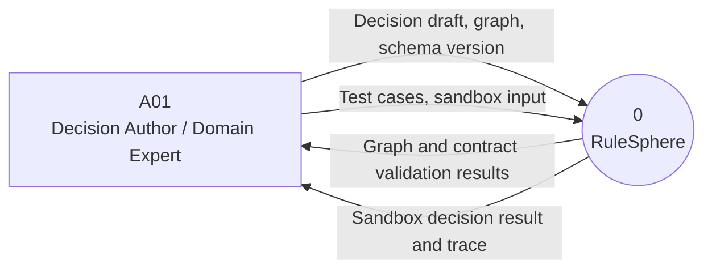
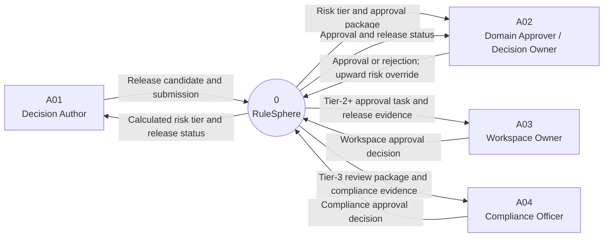
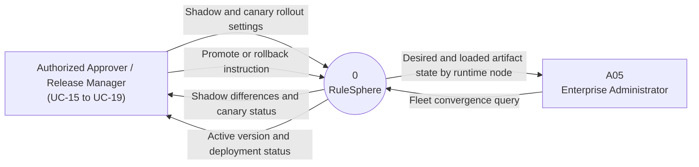
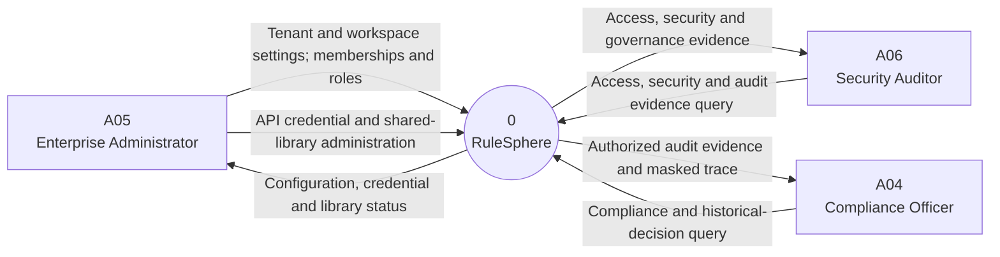
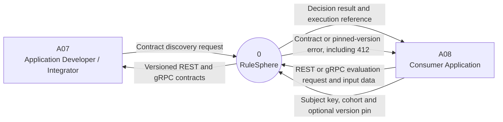

# RuleSphere — Yourdon–DeMarco Context Diagram by Function

Nguồn: `RuleSphere_SRS_v1.0_Final.docx` (RS-SRS-001, v1.0 Final), mục 2, 4, 6 và 7.

Mỗi hình dưới đây là một **góc nhìn của cùng tiến trình 0: RuleSphere**. Hình chữ nhật là thực thể ngoài; hình tròn là toàn bộ hệ thống. Các nhãn trên mũi tên là dữ liệu trao đổi qua ranh giới hệ thống.

## 1. Thiết kế, kiểm tra và chạy thử quyết định

SRS: UC-05 đến UC-09; FR về Decision Graph, schema và sandbox execution.

## 2. Quản trị phê duyệt

SRS: UC-10 đến UC-14; risk-based approval và immutable artifact.

## 3. Triển khai an toàn và đồng bộ runtime

SRS: UC-15 đến UC-20 và UC-27; shadow, canary, promotion, rollback và convergence.

## 4. Quản trị tenant, bảo mật và kiểm toán

SRS: UC-01 đến UC-04, UC-25 và UC-26; tenant isolation, trace và audit evidence.

## 5. Tích hợp và đánh giá quyết định tại runtime

SRS: UC-21 đến UC-24; REST/gRPC API, sticky cohort, version pinning và trace capture.
